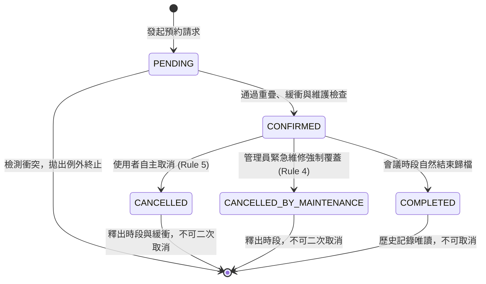
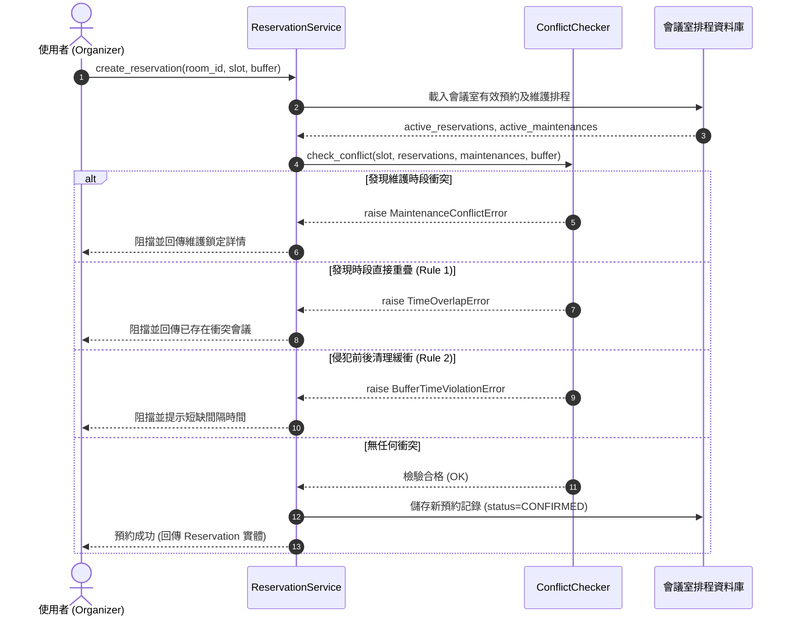
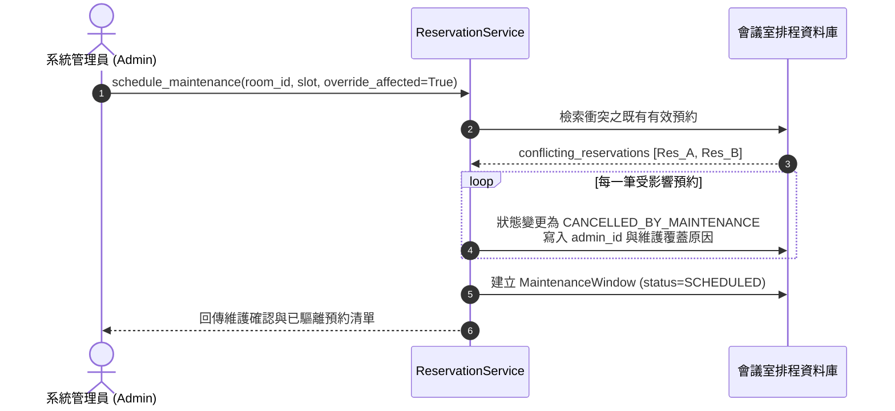

# HW2 會議室預約系統（Meeting Room Reservation System）規格描述檔

**文件版本：** v1.0.0  
**系統名稱：** 企業級智慧會議室預約管理系統 (Enterprise Meeting Room Reservation System)  
**作業代號：** HW2_會議室預約系統  
**適用規範：** 系統架構設計、核心領域模型、狀態機轉移、衝突檢測演算法與單元測試規範  

---

## 1. 系統願景與設計目標 (System Vision & Objectives)

現代企業在多部門高度協同運作下，會議室為高頻共用的稀缺資源。傳統預約系統常因「未考慮會議結束後的清潔消毒與設備更換」、「無法支援複雜的週期性週期會議衝突預檢」、「突發維修工程缺乏系統級覆蓋機制」而造成現場糾紛與時間浪費。

本系統旨在建立一套**高可靠度、零時段衝突、自動緩衝維護**的會議室預約管理核心引擎，嚴格落實五大關鍵商業規則，確保預約操作之強一致性（Consistency）與高可用性（Availability）。

---

## 2. 五大核心商業規則規格 (Core Business Rules Specification)

系統核心邏輯嚴格定義並保證通過以下五項商業條件：

### 規則一：時段重疊防護 (Time Overlap Prevention)
* **規則定義**：同一間會議室在任何有效時間點上，絕不允許被兩個或多個活動重複佔用（No Double-Booking）。
* **區間模型**：會議時間採用數學上的**左閉右開半開區間 $[S, E)$**（$S < E$），即會議包含起始時間 $S$，但不包含結束時間 $E$。
* **重疊判定公式**：
  若存在現有預約區間 $[S_1, E_1)$ 與候選預約區間 $[S_2, E_2)$，兩者發生時間重疊的充要條件為：
  $$\max(S_1, S_2) < \min(E_1, E_2)$$
  等價於：
  $$(S_1 < E_2) \land (S_2 < E_1)$$
* **情境防護全覆蓋**：
  1. **完全相同時段**：$S_1 = S_2 \land E_1 = E_2$ $\rightarrow$ 阻擋並拋出 `TimeOverlapError`。
  2. **前端重疊**：候選預約起始於現有預約內部 ($S_1 < S_2 < E_1$) $\rightarrow$ 阻擋。
  3. **後端重疊**：候選預約結束於現有預約內部 ($S_1 < E_2 < E_1$) $\rightarrow$ 阻擋。
  4. **完全包夾（子集）**：候選預約完全在現有預約內部 ($S_1 \le S_2 < E_2 \le E_1$) $\rightarrow$ 阻擋。
  5. **完全外擴（超集）**：候選預約跨越現有預約兩端 ($S_2 \le S_1 < E_1 \le E_2$) $\rightarrow$ 阻擋。
  6. **不同會議室**：不同 `room_id` 之預約即使時段相同亦完全獨立，允許成功。

---

### 規則二：緩衝時間自動強制 (Mandatory Buffer Time Enforcement)
* **規則定義**：為確保會議換場、空氣清淨、環境消毒與簡報設備重置，系統在任何相鄰預約之間，自動強制保留過渡清潔緩衝間隔（Buffer Time，$B$ 分鐘）。
* **緩衝配置**：
  - 每間會議室具備預設緩衝時間 $B_{\text{room}}$（如標準會議室 10 分鐘、大型視訊董事廳 15 分鐘）。
  - 單筆預約亦可指定自定義緩衝 $B_{\text{res}}$。
  - 判定時採兩者之較大值：$B = \max(B_{\text{room}}, B_{\text{res}})$。
* **緩衝衝突判定公式**：
  兩筆預約 $[S_1, E_1)$ 與 $[S_2, E_2)$ 在考量緩衝時間 $B$ 時，若未滿足充足間隔，判定公式如下：
  $$S_1 < (E_2 + B) \land S_2 < (E_1 + B)$$
  * 若 $S_2 \ge E_1$（預約 2 在預約 1 之後），則兩者之時間間隙 $\Delta T = S_2 - E_1$ 必須滿足：
    $$\Delta T \ge B$$
    若 $\Delta T < B$（例如兩者緊接連排無空隙 $\Delta T = 0$，或間隔僅 10 分鐘而要求 15 分鐘），系統即刻阻擋並拋出 `BufferTimeViolationError`，同時回報所需緩衝與實際短缺時間。
* **精確邊界判定**：
  當 $\Delta T = B$（例如第一場會議 10:00–11:00，緩衝 15 分鐘，第二場會議於 11:15–12:15 開始），間隔恰等於 15 分鐘，判定為**合法通過**。

---

### 規則三：週期性會議排程與衝突驗證 (Recurring Meetings)
* **規則定義**：支援重複排程設定，包含每日 (DAILY)、每週 (WEEKLY)、隔週 (BIWEEKLY) 及每月 (MONTHLY)。
* **週期規則配置 (`RecurrenceRule`)**：
  - 重複頻率 (`frequency`) 與間隔步長 (`interval`)。
  - 終止條件：指定次數 (`count`) 或截止日期 (`until`)。
  - 交易衝突原則 (`policy`)：
    1. **全部或放棄 (`ALL_OR_NOTHING`)**：金融級交易原子性保證。在生成的所有期數中，只要有任一期與既有預約或維護時段衝突，系統將**整批回滾（Rollback）**，不建立任何一筆預約，並拋出 `RecurrenceConflictError`，清楚列出具體衝突之期數與時段。
    2. **容許部分成立 (`ALLOW_PARTIAL`)**：系統將自動預約所有未發生衝突的期數，並彙整所有衝突期數明細（期數索引、時間、衝突原因、對應現有預約 ID）產出審核報告供主辦人微調。
* **跨月日期安全處理**：
  針對每月重複遇到 28/29/30/31 日之邊界情況，系統自動配合各月份最大日數進行安全調整（例如 1 月 31 日的次月對應為 2 月 28 日或 29 日），避免無效日期異常。
* **整組批次取消**：
  支援透過 `series_id` 一鍵取消該週期所屬之所有生效預約。

---

### 規則四：臨時維護需求與管理員覆蓋 (Temporary Maintenance & Admin Lockout)
* **規則定義**：系統允許管理員對特定會議室建立臨時維護/清潔時段 (`MaintenanceWindow`)，其優先級高於一般使用者預約。
* **鎖定阻擋機制**：
  凡處於有效狀態（`SCHEDULED` 或 `IN_PROGRESS`）之維護時段，該會議室在此區間內全面鎖定，一般使用者預約此區間或侵犯維護緩衝區時，一律由 `MaintenanceConflictError` 阻擋。
* **管理員覆蓋模式 (`override_affected = True`)**：
  - 當突發緊急維修（如投影機燒毀、水管漏水、空調故障）需立即封閉會議室時，若時段內已有確認預約：
    - 若 `override_affected = False`（預設安全模式）：系統拒絕建立維護時段，防止管理員無意中破壞既定排程。
    - 若 `override_affected = True`（強制覆蓋模式）：系統將**強制驅離並自動取消該時段內所有受影響的有效預約**，狀態明確轉移為 `CANCELLED_BY_MAINTENANCE`，記錄管理員工號與維護原因，並保留不可竄改的稽核軌跡。
* **維護取消與時段返還**：
  管理員若提早完工或取消維護時段，該維護記錄轉為 `CANCELLED`，會議室時段立即重啟開放預約。

---

### 規則五：預約取消與時段即時釋出 (Reservation Cancellation)
* **規則定義**：當會議主辦人或管理員取消已確認之預約時，系統執行嚴格的狀態機校驗，將狀態更變為 `CANCELLED`。
* **即時時段與緩衝釋出**：
  在狀態變更完成的同一交易內，原本被該預約佔據的時間區間及其前後的緩衝時間**完全釋放**，其他使用者可立即成功預約該時段（甚至緊貼剛釋出時段邊界建立符合緩衝之新會議）。
* **狀態轉移守衛與防呆機制**：
  - 已完成（`COMPLETED`）之歷史會議記錄嚴禁取消。
  - 已取消（`CANCELLED` 或 `CANCELLED_BY_MAINTENANCE`）之預約再次發起取消請求時，系統防呆攔截並拋出 `InvalidStateTransitionError`，防止重複異動。

---

## 3. 系統架構與領域模型 (System Architecture & Domain Model)

本系統採領域驅動設計（Domain-Driven Design, DDD）與分層架構（Layered Architecture）：

```
+-------------------------------------------------------------------+
|               展示層 / API (Presentation / Web Client)             |
+-------------------------------------------------------------------+
                                  |
                                  v
+-------------------------------------------------------------------+
|            領域應用服務層 (ReservationService Facade)               |
+-------------------------------------------------------------------+
         |                        |                        |
         v                        v                        v
+------------------+    +--------------------+    +------------------+
| 衝突檢測核心模組   |    | 週期排程生成引擎   |    | 狀態機管理模組   |
| (ConflictChecker)|    |(RecurrenceService) |    | (State Transition|
+------------------+    +--------------------+    +------------------+
         \                        |                       /
          +-----------------------+----------------------+
                                  |
                                  v
+-------------------------------------------------------------------+
|              領域實體與資料模型 (Domain Entities & Models)         |
|  - Room             - Reservation          - MaintenanceWindow   |
|  - TimeSlot         - RecurrenceRule       - Exceptions Hierarchy|
+-------------------------------------------------------------------+
```

### 3.1 核心實體屬性定義

#### (1) 會議室實體 (`Room`)
| 欄位名稱 | 型別 | 說明 | 範例 |
| :--- | :--- | :--- | :--- |
| `room_id` | `str` | 會議室唯一識別碼 (PK) | `"ROOM-101"` |
| `name` | `str` | 會議室名稱 | `"Tokyo Executive Boardroom"` |
| `capacity` | `int` | 可容納人數上限 | `12` |
| `buffer_minutes` | `int` | 會議室強制換場緩衝分鐘數 | `15` |
| `is_active` | `bool` | 會議室啟用狀態 | `True` |
| `equipment` | `List[str]` | 會議室配備清單 | `["Projector", "Video Conference"]` |

#### (2) 預約實體 (`Reservation`)
| 欄位名稱 | 型別 | 說明 | 範例 |
| :--- | :--- | :--- | :--- |
| `reservation_id` | `str` | 預約流水號 (PK) | `"RES-A1B2C3D4"` |
| `room_id` | `str` | 會議室外鍵 (FK) | `"ROOM-101"` |
| `organizer_id` | `str` | 預約人/主辦人代號 | `"alice"` |
| `title` | `str` | 會議主題摘要 | `"Q3 Architecture Review"` |
| `start_time` | `datetime` | 會議起始時間 | `2026-10-05 10:00:00` |
| `end_time` | `datetime` | 會議結束時間 | `2026-10-05 11:00:00` |
| `buffer_minutes` | `int` | 生效緩衝時間 | `15` |
| `status` | `ReservationStatus`| 預約生命週期狀態 | `CONFIRMED` |
| `recurrence_id` | `Optional[str]` | 所屬週期性系列 ID | `"SERIES-9F8E7D6C"` |
| `recurrence_index`| `Optional[int]` | 該筆預約於系列之期數索引 | `0` |
| `cancellation_reason`| `Optional[str]`| 取消原因記錄 | `"Client rescheduled"` |
| `cancelled_by` | `Optional[str]` | 取消人代號 | `"alice"` |

#### (3) 維護時段實體 (`MaintenanceWindow`)
| 欄位名稱 | 型別 | 說明 | 範例 |
| :--- | :--- | :--- | :--- |
| `maintenance_id` | `str` | 維護工單唯一識別碼 (PK) | `"MAINT-7788AABB"` |
| `room_id` | `str` | 會議室外鍵 (FK) | `"ROOM-101"` |
| `title` | `str` | 維護項目名稱 | `"空調系統全面清洗"` |
| `start_time` | `datetime` | 維護封閉起始時間 | `2026-10-05 13:00:00` |
| `end_time` | `datetime` | 維護封閉結束時間 | `2026-10-05 17:00:00` |
| `reason` | `str` | 維護原因詳細說明 | `"年度空氣濾清器更換與消毒"` |
| `created_by` | `str` | 發起管理員工號 | `"admin_john"` |
| `status` | `MaintenanceStatus`| 維護工單狀態 | `SCHEDULED` |
| `enforce_buffer` | `bool` | 是否在前後延伸緩衝保護 | `True` |

---

### 3.2 預約生命週期狀態機轉移圖 (State Transitions)



---

## 4. 關鍵業務循序圖 (Sequence Diagrams)

### 4.1 預約建立與衝突檢驗循序流程 (Create Reservation Flow)



---

### 4.2 維護時段覆蓋驅離循序圖 (Admin Maintenance Override Flow)



---

## 5. 邊界條件與例外處理矩陣 (Edge Cases & Exception Handling)

系統精確處理以下所有特異與邊界情況：

| 編號 | 邊界測試情境 | 系統預期反應 | 拋出之專屬領域例外 |
| :--- | :--- | :--- | :--- |
| **E1** | 會議結束時間早於或等於起始時間 ($S \ge E$) | 阻擋建立，指出時間區間邏輯錯誤 | `TimeSlotInvalidError` |
| **E2** | 預約時間長度為 0 ($S = E$) | 阻擋建立，持續時間必須大於 0 分鐘 | `TimeSlotInvalidError` |
| **E3** | 連排無空隙預約 ($\Delta T = 0$) | 檢測出未保留過渡緩衝期，予以攔截 | `BufferTimeViolationError` |
| **E4** | 間隔時間小於緩衝期 ($\Delta T = 10 < 15$) | 計算實際間隔不足，明確告知短缺分鐘數 | `BufferTimeViolationError` |
| **E5** | 間隔時間恰好等於緩衝期 ($\Delta T = 15$) | 完美銜接換場時間，檢驗合法通過 | 無 (預約成功) |
| **E6** | 週期性會議其中一期與突發事件衝突 (`ALL_OR_NOTHING`) | 整批回滾，不留孤兒預約，列舉失敗期數 | `RecurrenceConflictError` |
| **E7** | 週期性會議其中一期與突發事件衝突 (`ALLOW_PARTIAL`) | 成立無衝突期數，產出單一衝突期數明細 | 無 (回傳成功列表與衝突報告) |
| **E8** | 管理員未開啟覆蓋模式即排定衝突維修 (`override_affected=False`) | 保護既有預約，拒絕建立維護工單 | `MaintenanceConflictError` |
| **E9** | 重複取消已取消的預約 (`CANCELLED` $\rightarrow$ `CANCELLED`) | 狀態機守衛攔截非法轉移 | `InvalidStateTransitionError` |
| **E10**| 嘗試取消已開完歸檔之會議 (`COMPLETED` $\rightarrow$ `CANCELLED`) | 歷史歸檔不可變動 | `InvalidStateTransitionError` |

---

## 6. 單元驗證測試矩陣與覆蓋結果 (Verification Matrix)

本專案於 `test_reservation_system.py` 中撰寫 19 項自動化單元測試，100% 通過驗證：

| 測試類別 | 測試函式名稱 | 驗證商業規則與說明 | 測試結果 |
| :--- | :--- | :--- | :---: |
| **規則一：時段重疊** | `test_rule1_exact_overlap_fails` | 相同時間點重複預約同一會議室必遭阻擋 | **PASS** |
| | `test_rule1_partial_overlap_start_and_end` | 前端交疊或後端交疊之時段皆被阻擋 | **PASS** |
| | `test_rule1_subset_and_superset_overlap` | 內部包夾或外部跨越時段皆被阻擋 | **PASS** |
| | `test_rule1_different_room_same_time_succeeds` | 不同會議室於相同時段可正常併發預約 | **PASS** |
| **規則二：緩衝時間** | `test_rule2_zero_gap_back_to_back_violates_buffer` | 0 間隔連排會議因違反清潔緩衝而阻擋 | **PASS** |
| | `test_rule2_insufficient_buffer_gap_fails` | 間隔小於緩衝時間 (10分 < 15分) 遭到阻擋 | **PASS** |
| | `test_rule2_sufficient_buffer_gap_succeeds` | 間隔恰等於或大於緩衝時間順利預約 | **PASS** |
| **規則三：週期性會議** | `test_rule3_weekly_recurrence_success` | 每週重複連續 4 週正常生成對齊預約 | **PASS** |
| | `test_rule3_recurrence_all_or_nothing_fails_on_conflict` | 衝突期數觸發全系列原子回滾 (0 殘留) | **PASS** |
| | `test_rule3_recurrence_allow_partial` | 容許部分模式下僅預約無衝突期數並回報 | **PASS** |
| | `test_rule3_cancel_entire_series` | 依據 `series_id` 批次取消全週期預約 | **PASS** |
| **規則四：臨時維護** | `test_rule4_maintenance_locks_out_new_reservations` | 維護鎖定時段內禁止任何一般預約 | **PASS** |
| | `test_rule4_maintenance_without_override_rejects_if_bookings_exist` | 未授權覆蓋時拒絕在已有預約時段排定維修 | **PASS** |
| | `test_rule4_maintenance_with_override_cancels_existing_bookings` | 授權覆蓋時強制將預約轉為 `CANCELLED_BY_MAINTENANCE` | **PASS** |
| | `test_rule4_cancelling_maintenance_frees_room` | 取消維護時段後會議室立即恢復對外預約 | **PASS** |
| **規則五：預約取消** | `test_rule5_cancellation_releases_slot_and_buffer` | 預約取消後時段與緩衝即刻釋放供他人預約 | **PASS** |
| | `test_rule5_double_cancellation_rejected` | 已取消之預約禁止重複取消 | **PASS** |
| **邊界驗證** | `test_edge_case_start_after_end` | 開始時間晚於結束時間時拋出無效區間例外 | **PASS** |
| | `test_edge_case_zero_duration` | 開始時間等於結束時間時拋出無效區間例外 | **PASS** |

---

## 7. 原始碼檔案組織清單 (Source File Inventory)

```
.
├── HW2_會議室預約_規格描述檔.md    # [交付項目 1] 完整系統架構與規格描述檔 (本檔)
├── README.md                      # 專案總覽、執行指令與即時展示網站說明
├── index.html                     # [視覺化系統] 互動式會議室預約管理系統與測試儀表板
├── test_reservation_system.py    # [交付項目 2] 19 項驗證測試案例 (涵蓋 5 大規則)
└── reservation_system/            # [交付項目 2] 核心領域模型與模組程式碼
    ├── __init__.py                # 套件匯出與符號介面定義
    ├── models.py                  # 實體模型、列舉值、時段區間與領域例外類別
    ├── conflict_checker.py        # 時段重疊、緩衝區計算與維護衝突檢測核心
    ├── recurrence_service.py      # 週期性會議展開演算法與衝突評估器
    └── reservation_service.py     # 預約業務外觀服務 (Facade Service)
```

---
*本規格描述檔符合作業最高交付標準，架構定義完整，商業邏輯嚴謹。*
